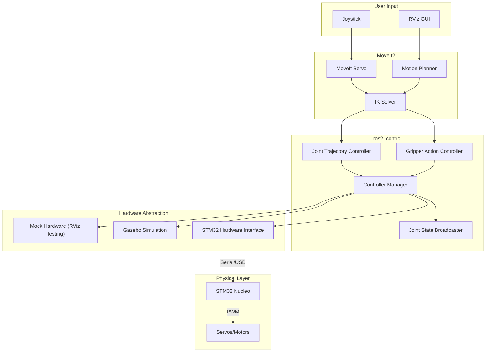
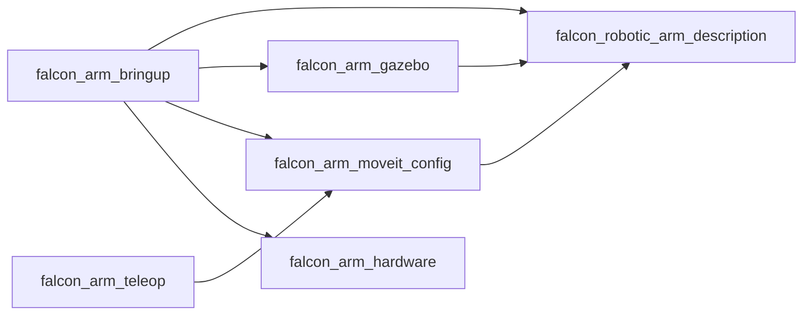

# System Architecture

This document describes the system architecture for the Falcon Robot Arm.

## High-Level Architecture



## Component Descriptions

### User Input Layer

#### Joystick
- Uses `joy` package to read joystick input
- Publishes `sensor_msgs/Joy` messages
- Mapped to end-effector velocities via `falcon_arm_teleop`

#### RViz GUI
- Interactive markers for goal pose setting
- Motion planning panel for trajectory execution
- Joint state visualization

### Motion Planning Layer

#### MoveIt Servo
- Real-time end-effector velocity control
- Converts joystick input to joint velocities
- Collision checking during motion
- Located in `falcon_arm_teleop` package

#### Motion Planner
- OMPL-based path planning
- Collision-free trajectory generation
- Multiple planning algorithms available

#### IK Solver
- KDL (default) or TRAC-IK
- Converts Cartesian goals to joint configurations
- Configured in `falcon_arm_moveit_config`

### Control Layer

#### Controller Manager
- Manages all ros2_control controllers
- Handles controller switching
- Broadcasts joint states

#### Joint Trajectory Controller
- Executes joint trajectories from MoveIt2
- `FollowJointTrajectory` action interface
- Controls joints 1-6 (arm)

#### Joint State Broadcaster
- Publishes `/joint_states` topic
- Used by robot_state_publisher for TF

#### Gripper Action Controller
- Separate controller for gripper
- `GripperCommand` action interface
- Controls gripper position and effort

### Hardware Abstraction Layer

#### Mock Hardware
- `mock_components/GenericSystem` plugin
- Instant feedback, no physics
- Used for URDF testing in RViz
- Enabled via `use_mock_hardware:=true`

#### Gazebo Simulation
- `gz_ros2_control` plugin
- Physics-based simulation
- Enabled via `sim_gazebo:=true`

#### STM32 Hardware Interface
- Custom `falcon_arm_hardware` plugin
- Serial communication with STM32
- Real hardware control

### Physical Layer

#### STM32 Nucleo
- Receives position commands via serial
- Sends encoder feedback at 50 Hz
- Implements low-level motor control

#### Servos/Motors
- 6 joint motors for arm
- 1 servo for gripper
- PWM controlled

## Data Flow

### Motion Planning Flow
```
RViz Goal → MoveIt Planner → IK Solver → Joint Trajectory → JTC → Hardware Interface
```

### Teleoperation Flow
```
Joystick → Joy Node → Teleop Node → MoveIt Servo → IK → JTC → Hardware Interface
```

### Feedback Flow
```
Hardware Interface → Joint State Broadcaster → /joint_states → robot_state_publisher → TF
```

## Package Dependencies



## ROS2 Topics and Services

### Published Topics
| Topic | Type | Source |
|-------|------|--------|
| `/joint_states` | `sensor_msgs/JointState` | Joint State Broadcaster |
| `/tf` | `tf2_msgs/TFMessage` | robot_state_publisher |
| `/robot_description` | `std_msgs/String` | robot_state_publisher |

### Action Servers
| Action | Type | Server |
|--------|------|--------|
| `/joint_trajectory_controller/follow_joint_trajectory` | `FollowJointTrajectory` | JTC |
| `/gripper_action_controller/gripper_cmd` | `GripperCommand` | Gripper Controller |
| `/move_action` | `MoveGroup` | MoveIt2 |

### Services
| Service | Type | Server |
|---------|------|--------|
| `/controller_manager/list_controllers` | `ListControllers` | Controller Manager |
| `/compute_ik` | `GetPositionIK` | MoveIt2 |
| `/compute_fk` | `GetPositionFK` | MoveIt2 |

## Configuration Files

### Controller Configuration (`controllers.yaml`)
```yaml
controller_manager:
  ros__parameters:
    update_rate: 100  # Hz

joint_state_broadcaster:
  ros__parameters:
    type: joint_state_broadcaster/JointStateBroadcaster

joint_trajectory_controller:
  ros__parameters:
    type: joint_trajectory_controller/JointTrajectoryController
    joints:
      - joint_1
      - joint_2
      - joint_3
      - joint_4
      - joint_5
      - joint_6
    command_interfaces:
      - position
    state_interfaces:
      - position
      - velocity

gripper_action_controller:
  ros__parameters:
    type: gripper_action_controller/GripperActionController
    joint: gripper_joint
    goal_tolerance: 0.01
    max_effort: 10.0
```

### ros2_control Hardware Configuration (URDF xacro)
```xml
<ros2_control name="FalconArmSystem" type="system">
  <hardware>
    <!-- Conditional hardware selection -->
    <xacro:if value="${use_mock_hardware}">
      <plugin>mock_components/GenericSystem</plugin>
    </xacro:if>
    <xacro:if value="${sim_gazebo}">
      <plugin>gz_ros2_control/GazeboSimSystem</plugin>
    </xacro:if>
    <xacro:unless value="${use_mock_hardware or sim_gazebo}">
      <plugin>falcon_arm_hardware/FalconArmHardwareInterface</plugin>
      <param name="serial_port">/dev/ttyACM0</param>
      <param name="baud_rate">115200</param>
    </xacro:unless>
  </hardware>

  <!-- Joint interfaces -->
  <joint name="joint_1">
    <command_interface name="position"/>
    <state_interface name="position"/>
    <state_interface name="velocity"/>
  </joint>
  <!-- ... more joints ... -->
</ros2_control>
```

## Launch Configurations

### RViz + Mock Hardware
```
robot_rviz.launch.py
├── robot_state_publisher (URDF with use_mock_hardware:=true)
├── controller_manager
├── joint_state_broadcaster
├── joint_trajectory_controller
├── gripper_action_controller
└── rviz2
```

### Gazebo Simulation
```
robot_sim.launch.py
├── robot_state_publisher (URDF with sim_gazebo:=true)
├── gz_sim (Gazebo Fortress)
├── spawn_entity
├── gz_ros2_control
├── controller_manager
├── joint_state_broadcaster
├── joint_trajectory_controller
├── gripper_action_controller
└── rviz2 (optional)
```

### Real Hardware
```
robot_hardware.launch.py
├── robot_state_publisher (URDF, default hardware)
├── controller_manager
├── joint_state_broadcaster
├── joint_trajectory_controller
├── gripper_action_controller
└── rviz2 (optional)
```

### MoveIt2 + Simulation
```
robot_moveit_sim.launch.py
├── robot_sim.launch.py
├── move_group
├── moveit_servo (optional)
└── rviz2 (with MoveIt plugin)
```

## Security Considerations

- Serial port access requires `dialout` group membership
- No hardcoded credentials
- Emergency stop accessible at hardware level
- Watchdog timeout on STM32 (500ms command timeout)
